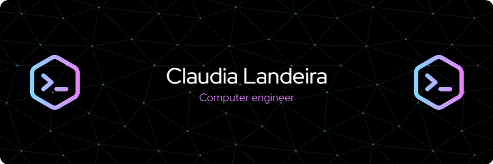

Hi! I'm Claudia ([@claudialandeirav](https://github.com/claudialandeirav)).

I am a passionate individual about computer science, recently graduated in Computer Engineering, and currently working as a junior developer at a technology company. My academic and professional background has provided me with a solid foundation in computer science, but my true passion lies in the creativity and innovation involved in software development.

In addition to my work, I am committed to my personal and professional growth. I am currently dedicating time to improving my proficiency in the English language and working towards achieving level C1. I firmly believe in the importance of continuous learning and exploring new areas of knowledge.

I love embarking on personal projects that challenge me and allow me to explore new technologies and approaches. Recently, I have been venturing into Android app development, which is an exciting area full of possibilities. I am thrilled to apply my frontend skills in this new field and create unique and engaging mobile experiences.

In summary, I am an enthusiastic and dedicated developer, always seeking to expand my skills and knowledge while working on projects that inspire me and allow me to grow both professionally and personally.

## 

  
##

                                                    
